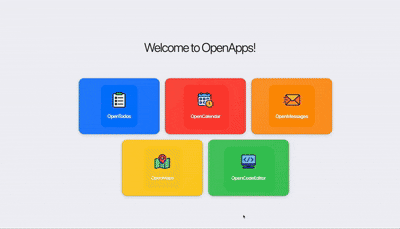

<!--
Copyright (c) Meta Platforms, Inc. and affiliates.
All rights reserved.

This source code is licensed under the BSD-style license found in the
LICENSE file in the root directory of this source tree.
-->

<div align="center">

# OpenApp Environment


*A web application simulation environment for OpenEnv that wraps the [OpenApps](https://github.com/facebookresearch/OpenApps) framework and BrowserGym.*

</div>

## Overview

The OpenApp environment provides a simulated web application ecosystem where agents can interact with various apps (calendar, todo, messenger, maps) using browser-based actions.

<div align="center">

</div>

This environment is ideal for:

- Training and evaluating UI agents
- Testing web automation strategies
- Researching human-computer interaction
- Developing multimodal agents

## Features

- **Multiple Apps**: Interact with calendar, todo list, messenger, and map applications
- **Browser-Based Actions**: Click, fill forms, navigate, scroll, and more
- **Task-Based Evaluation**: Optional task goals with automatic reward calculation
- **Configurable**: Customize app configurations and behavior
- **BrowserGym Integration**: Built on top of BrowserGym for robust browser interaction

## Directory Structure

```
openapp_env/
├── __init__.py                   # Package exports
├── client.py                     # HTTP client for connecting to OpenApp
├── models.py                     # Data models for actions and observations
├── pyproject.toml                # Package dependencies and configuration
├── openenv.yaml                  # OpenEnv environment configuration
├── test_openapp_env.py           # Unit tests for environment structure
├── README.md                     # This file
├── IMPLEMENTATION.md             # Implementation details and design decisions
├── example_usage.py              # Basic usage example (legacy)
├── assets/                       # Images and media
│   ├── OpenApps_OpenEnv_RL.png   # Environment overview diagram
│   └── openapps-demo.gif         # Demo animation
└── server/                       # Server-side environment implementation
    ├── __init__.py
    ├── app.py                    # FastAPI server application
    ├── openapp_environment.py    # Core environment logic (BrowserGym + OpenApps)
    ├── Dockerfile                # Docker image definition
    └── start.sh                  # Container startup script (runs both servers)
```

**Key Components:**

- **client.py**: `OpenAppEnv` class that extends `HTTPEnvClient` for remote environment interaction
- **models.py**: `OpenAppAction` and `OpenAppObservation` dataclasses with validation
- **server/openapp_environment.py**: `OpenAppEnvironment` class that wraps BrowserGym and OpenApps
- **server/app.py**: FastAPI server that exposes the environment via HTTP endpoints
- **server/Dockerfile**: Self-contained Docker image with OpenApps server and FastAPI server
- **server/start.sh**: Startup script that launches both OpenApps (port 5001) and FastAPI (port 8000)

## Installation

There are two ways to use the OpenApp environment: **Docker mode** (recommended, fully self-contained) or **Local mode** (requires manual server setup).

### Option 1: Docker Mode (Recommended)

Docker mode is fully self-contained and handles all dependencies automatically. No local installation required!

**Step 1: Build the Docker image**

The Docker image can be built in standalone mode using only public base images:

```bash
# Build from the environment directory
cd envs/openapp_env
docker build -t openapp-env:latest -f server/Dockerfile .
```

**Note for Meta/Corporate Networks:** If you're behind a proxy (HTTP_PROXY/HTTPS_PROXY set), you may need to bypass it for localhost connections:
```bash
export NO_PROXY=localhost,127.0.0.1
cd envs/openapp_env
docker build -t openapp-env:latest -f server/Dockerfile .
```

**What gets installed in Docker:**
- **OpenEnv core**: Installed as a dependency
- **OpenApps**: Cloned from GitHub and installed (runs server inside container)
- **Core packages**: FastAPI, Uvicorn, Pydantic, Requests (from pyproject.toml)
- **BrowserGym**: For browser automation
- **Playwright**: Chromium browser for UI interaction
- **Web interface support**: Enabled by default via `ENABLE_WEB_INTERFACE=true`

**How Docker mode works:**
The Docker container runs TWO services automatically:
1. **OpenApps server** (port 5001) - Provides the web applications (calendar, todo, messenger, maps)
2. **FastAPI server** (port 8000) - Exposes the OpenEnv HTTP API

Both servers start automatically when the container launches. You only interact with port 8000.

**Build details:**
- Base image: `python:3.11-slim` (public)
- Installation: Uses `pip install -e .` with pyproject.toml
- System deps: Playwright/Chromium dependencies for browser automation
- Size: ~5.7GB (includes Chromium browser and all dependencies)

**Step 2: Run the example**
```bash
# For Meta/Corporate Networks with proxy, also set NO_PROXY:
export NO_PROXY=localhost,127.0.0.1

python examples/openapp_example.py --mode docker
```

**Note:** For Docker mode, you only need Python installed locally to run the example script. All environment dependencies are inside the Docker container.

### Option 2: Local Mode

Local mode requires manual setup of the OpenApps server. This mode is useful for development or when you need to customize the OpenApps configuration.

**Prerequisites:**
- Python 3.11+ installed
- UV package manager (recommended) or pip

**Step 1: Install openapp_env**
```bash
cd envs/openapp_env
pip install -e .
```

This installs the environment package along with dependencies (BrowserGym, Playwright, etc.).

**Step 2: Install Playwright browsers**
```bash
playwright install chromium
```

**Step 3: Clone and set up OpenApps** (for running the server)
```bash
# Clone OpenApps repository
git clone https://github.com/facebookresearch/OpenApps.git
cd OpenApps

# Install dependencies
uv sync  # or: pip install -e .
```

**Why do I need the OpenApps repository?**

The OpenApps Python package (installed via pip in Step 1) provides the library code, but the repository contains:
- `launch.py` - The server startup script
- `config/` - Hydra configuration files
- Application templates and assets

In Docker mode, all of this is included in the container, so you don't need to clone anything.

## Quick Start

### Running with Docker (Recommended)

Docker mode is the easiest way - everything is automated:

```bash
# For Meta/Corporate networks with proxy, set NO_PROXY first:
export NO_PROXY=localhost,127.0.0.1

# Run the example
python examples/openapp_example.py --mode docker
```

The Docker container automatically:
- Starts the OpenApps server (port 5001)
- Starts the FastAPI server (port 8000)
- Manages both services for you

No manual server setup required!

**What happens inside the container:**

When you run `from_docker_image()`, the following happens automatically:

1. **Container Startup** (`/app/start.sh` runs):
   ```bash
   # Launches OpenApps server in background
   cd /app/openapps
   python launch.py &

   # Waits for port 5001 to be ready
   # Then starts FastAPI server
   uvicorn openapp_env.server.app:app --host 0.0.0.0 --port 8000
   ```

2. **Your client code** interacts only with port 8000:
   ```python
   client = OpenAppEnv.from_docker_image("openapp-env:latest")
   # Client -> FastAPI (port 8000) -> OpenApps (port 5001)
   ```

3. **On cleanup**, both servers are automatically stopped when the container is removed.

### Running Locally

For local usage, you need the OpenApps repository to run the server:

**Step 1: Clone OpenApps (if you haven't already)**
```bash
git clone https://github.com/facebookresearch/OpenApps.git
cd OpenApps
uv sync
```

**Step 2: Start OpenApps Server** (in terminal 1)

To run the server in **headless mode** (no browser window):
```bash
cd OpenApps  # or wherever you cloned it
uv run launch.py

# or instead of the uv run you can use the Python command:
python OpenApps/launch.py
```

To run the server with **visible browser** for visualization:
```bash
cd OpenApps
python OpenApps/launch.py browsergym_env_args.headless=False
```

Wait for the server to start (you'll see "Port 5001 is available" or similar).

**Step 3: Run your code** (in terminal 2)
```bash
export OPENAPPS_URL=http://localhost:5001
python examples/openapp_example.py --mode local
```

**Note:** The OpenApps Python package (installed via pip) provides the modules, but you need the full repository to run launch.py with its config files.

### Example Script

```bash
# Run with Docker (recommended)
python examples/openapp_example.py --mode docker

# Run locally (requires OpenApps server running)
export OPENAPPS_URL=http://localhost:5001
python examples/openapp_example.py --mode local

# Show browser window to visualize agent actions
python examples/openapp_example.py --mode local --show-browser

# Run with custom number of steps
python examples/openapp_example.py --mode docker --num-steps 20

# See all options
python examples/openapp_example.py --help
```

### Visualizing Agent Interactions

There are multiple ways to see what the agent is doing:

**Option 1: Show Browser Window (Local Mode)**

The key is to start the OpenApps server with visualization enabled:

```bash
# Terminal 1: Start OpenApps server with visible browser
cd OpenApps
python OpenApps/launch.py browsergym_env_args.headless=False

# Terminal 2: Run your agent code
export OPENAPPS_URL=http://localhost:5001
python examples/openapp_example.py --mode local
```

**Important:** The browser visualization is controlled by the OpenApps server, not the client. You must launch the server with `browsergym_env_args.headless=False` to see the browser window.

**Option 2: Access Web Interface Directly**

While the OpenApps server is running, open your browser to:
- Main page: `http://localhost:5001`
- Calendar: `http://localhost:5001/calendar`
- Todo: `http://localhost:5001/todo`
- Messenger: `http://localhost:5001/messages`
- Maps: `http://localhost:5001/maps`

**Option 3: Docker Web Interface**

When running in Docker mode, you can also access a web interface for manual testing:

```bash
# Start a container and keep it running
docker run -d -p 8000:8000 openapp-env:latest

# Access the web interface
# - Interactive UI: http://localhost:8000/web
# - API docs: http://localhost:8000/docs
# - OpenApps (internal): http://localhost:5001 (inside container)
```

**Note:** In Docker mode, the OpenApps server runs inside the container and is not directly accessible from your host machine. The FastAPI server at port 8000 acts as a proxy to interact with OpenApps.

### Basic Usage

```python
from envs.openapp_env import OpenAppAction, OpenAppEnv

# Create environment from Docker image
client = OpenAppEnv.from_docker_image("openapp-env:latest")

# Reset to initial state
result = client.reset()
print(f"Starting URL: {result.observation.url}")

# Navigate to calendar app
result = client.step(OpenAppAction(
    action_type="goto",
    url="http://localhost:5001/calendar"
))

# Click on a button (example bid)
result = client.step(OpenAppAction(
    action_type="click",
    bid="add-event-btn"
))

# Fill in a form field
result = client.step(OpenAppAction(
    action_type="fill",
    bid="event-title-input",
    text="Team Meeting"
))

print(f"Reward: {result.reward}")
print(f"Done: {result.done}")

# Cleanup
client.close()
```

### Action Types

The environment supports the following action types:

- **click**: Click on an element
  - Required: `bid` (BrowserGym element ID)

- **fill**: Fill a text input field
  - Required: `bid`, `text`

- **select_option**: Select from dropdown
  - Required: `bid`, `value`

- **goto**: Navigate to a URL
  - Required: `url`

- **scroll**: Scroll the page
  - Required: `direction` ("up" or "down")

- **send_keys**: Send keyboard input
  - Required: `text`

- **noop**: No operation

### Observations

Each observation includes:

- **html**: Current page HTML content
- **url**: Current page URL
- **open_pages_urls**: List of all open page URLs
- **active_page_index**: Index of currently active page
- **screenshot**: Base64-encoded screenshot (optional)
- **axtree_txt**: Accessibility tree for element interaction
- **app_state**: Current state of all apps (calendar events, todos, messages, etc.)
- **task_info**: Information about current task (if using tasks)
- **last_action_error**: Error message if last action failed

## Configuration

### Environment Parameters

```python
from envs.openapp_env.server.openapp_environment import OpenAppEnvironment

env = OpenAppEnvironment(
    web_app_port=5001,                   # Port for OpenApps server
    headless=True,                       # Run browser in headless mode
    task_name="add_meeting",             # Optional task name
    apps_config={},                      # App-specific configuration
    max_steps=50,                        # Maximum steps per episode
)
```

**Note:** OpenApps is automatically detected from the installed Python package. You can optionally override with `openapps_path` parameter or `OPENAPPS_PATH` environment variable if needed.

## Tasks and Rewards

The environment can be configured with specific tasks from OpenApps. Tasks define:
- Goal state (e.g., "Add a meeting with Dennis to the calendar")
- Reward function based on app state changes
- Success criteria

See [OpenApps documentation](https://facebookresearch.github.io/OpenApps/) for available tasks.

## Example: Task-Based Training

```python
from envs.openapp_env import OpenAppAction, OpenAppEnv

# Create environment with a specific task
client = OpenAppEnv.from_docker_image("openapp-env:latest")

# The task will guide the agent toward a specific goal
# Rewards will be based on progress toward completing the task
result = client.reset()

# Agent interacts to complete the task
# ... agent logic here ...

client.close()
```

## Development

### Running Server Locally (without Docker)

```bash
cd envs/openapp_env
uv run server
```

The server will start at `http://localhost:8000`

### Testing

```python
from openapp_env.server.openapp_environment import OpenAppEnvironment
from openapp_env.models import OpenAppAction

def test_environment():
    env = OpenAppEnvironment()

    # Test reset
    obs = env.reset()
    assert obs.url != ""

    # Test step
    action = OpenAppAction(action_type="noop")
    obs = env.step(action)
    assert env.state.step_count == 1

    # Cleanup
    env.close()

test_environment()
```

## Attribution

This environment integrates:
- [OpenApps](https://github.com/facebookresearch/OpenApps) - Web application simulation framework
- [BrowserGym](https://github.com/ServiceNow/BrowserGym) - Browser automation environment

## Troubleshooting

### Docker Build Issues

**Error: `Container did not become ready`**

If you're behind a corporate proxy (Meta/Facebook networks), set `NO_PROXY`:
```bash
export NO_PROXY=localhost,127.0.0.1
docker build -t openapp-env:latest -f envs/openapp_env/server/Dockerfile .
```

**Error: `Environment variable 'USER' not found`**

This is automatically handled in the Dockerfile with `ENV USER=root`. If you see this, rebuild the image.

**Container exits immediately**

Check the logs to see which server failed:
```bash
docker logs <container-id>
```

Common causes:
- OpenApps server failed to start (check for port conflicts)
- Missing dependencies (rebuild with `--no-cache`)

### Local Mode Issues

**Error: `OPENAPPS_URL not set`**

Set the environment variable before running:
```bash
export OPENAPPS_URL=http://localhost:5001
python examples/openapp_example.py --mode local
```

**Error: `Connection refused to localhost:5001`**

Make sure the OpenApps server is running:
```bash
cd OpenApps
uv run launch.py
```

**Browser visualization not working**

The visualization is controlled by the **server**, not the client:
```bash
# Start server with visible browser
cd OpenApps
python launch.py browsergym_env_args.headless=False
```

### Performance Issues

**Docker container is slow**

The container runs both a full Chromium browser and web applications. For faster performance:
- Increase Docker memory allocation (6GB+ recommended)
- Use headless mode (default)
- Reduce `max_steps` in environment configuration

**Large Docker image size**

The image is ~5.7GB due to:
- Chromium browser (~1.5GB)
- OpenApps dependencies (~2GB)
- BrowserGym and ML libraries (~2GB)

This is expected for a full browser automation environment.

## License

BSD 3-Clause License (see LICENSE file in OpenEnv root directory)

## Citation

If you use this environment in your research, please cite both OpenEnv and OpenApps:

```bibtex
@article{ullrich2025openapps0,
  title   = {OpenApps: Simulating Environment Variations to Measure UI-Agent Reliability},
  author  = {Karen Ullrich and Jingtong Su and Claudia Shi and Arjun Subramonian and Amir Bar and Ivan Evtimov and Nikolaos Tsilivis and Randall Balestriero and Julia Kempe and Mark Ibrahim},
  year    = {2025},
  journal = {arXiv preprint arXiv: 2511.20766}
}
```
