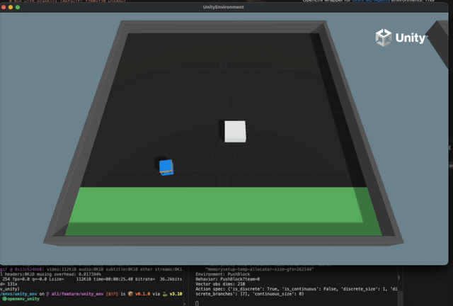

<!--
Copyright (c) Meta Platforms, Inc. and affiliates.
All rights reserved.
This source code is licensed under the BSD-style license found in the
LICENSE file in the root directory of this source tree.
-->


# Unity ML-Agents Environment

OpenEnv wrapper for [Unity ML-Agents](https://github.com/Unity-Technologies/ml-agents) environments. This environment provides access to Unity's reinforcement learning environments through a standardized HTTP/WebSocket interface.

<div align="center">
  
  
</div>

## Supported Environments

| Environment | Action Type | Description |
|------------|-------------|-------------|
| **PushBlock** | Discrete (7) | Push a block to a goal position |
| **3DBall** | Continuous (2) | Balance a ball on a platform |
| **3DBallHard** | Continuous (2) | Harder version of 3DBall |
| **GridWorld** | Discrete (5) | Navigate a grid to find goals |
| **Basic** | Discrete (3) | Simple left/right movement |

More environments may be available depending on the ML-Agents registry version.

## Installation

### Option 1: Non-Docker Installation (Local Development)

#### Prerequisites

- Python 3.10+
- [uv](https://docs.astral.sh/uv/) (recommended) or pip

#### Install from OpenEnv Repository

```bash
# Clone the OpenEnv repository (if not already done)
git clone https://github.com/your-org/OpenEnv.git
cd OpenEnv

# Install the unity_env package with dependencies
cd envs/unity_env
uv pip install -e .

# Or with pip
pip install -e .
```

#### Install Dependencies Only

```bash
cd envs/unity_env

# Using uv (recommended)
uv sync

# Or using pip
pip install -r requirements.txt  # if available
pip install mlagents-envs numpy pillow fastapi uvicorn pydantic
```

#### Verify Installation

```bash
# Test the installation
cd envs/unity_env
python -c "from client import UnityEnv; print('Installation successful!')"
```

**Note:** The first run will download Unity environment binaries (~500MB). These are cached in `~/.mlagents-cache/` for future use.

### Option 2: Docker Installation

#### Prerequisites

- Docker installed and running
- Python 3.10+ (for running the client)

#### Build the Docker Image

```bash
cd envs/unity_env

# Build the Docker image
docker build -f server/Dockerfile -t unity-env:latest .

# Verify the build
docker images | grep unity-env
```

**Note for Apple Silicon (M1/M2/M3/M4) users:** Docker mode is **not supported** on Apple Silicon because Unity's Mono runtime crashes under x86_64 emulation. Use **direct mode** (`--direct`) or **server mode** (`--url`) instead, which run native macOS binaries. See [Troubleshooting](#docker-mode-fails-on-apple-silicon-m1m2m3m4) for details.

#### Run the Docker Container

```bash
# Run with default settings (graphics enabled, 800x600)
docker run -p 8000:8000 unity-env:latest

# Run with custom settings
docker run -p 8000:8000 \
  -e UNITY_NO_GRAPHICS=0 \
  -e UNITY_WIDTH=1280 \
  -e UNITY_HEIGHT=720 \
  -e UNITY_TIME_SCALE=1.0 \
  unity-env:latest

# Run in headless mode (faster for training)
docker run -p 8000:8000 \
  -e UNITY_NO_GRAPHICS=1 \
  -e UNITY_TIME_SCALE=20 \
  unity-env:latest

# Run with persistent cache (avoid re-downloading binaries)
docker run -p 8000:8000 \
  -v ~/.mlagents-cache:/root/.mlagents-cache \
  unity-env:latest
```

#### Install Client Dependencies

To connect to the Docker container, install the client on your host machine:

```bash
cd envs/unity_env
pip install requests websockets
```

## Quick Start

### Option 1: Direct Mode (Fastest for Testing)

Run the Unity environment directly without a server:

```bash
# From the OpenEnv repository root:

# Run with graphics (default: 1280x720)
python examples/unity_simple.py --direct

# Run with custom window size
python examples/unity_simple.py --direct --width 800 --height 600

# Run headless (faster for training)
python examples/unity_simple.py --direct --no-graphics --time-scale 20

# Run 3DBall environment
python examples/unity_simple.py --direct --env 3DBall --episodes 5
```

### Option 2: Server Mode

Start the server and connect with a client:

```bash
# Terminal 1: Start the server (graphics enabled by default)
cd envs/unity_env
uv run uvicorn server.app:app --host 0.0.0.0 --port 8000

# Terminal 2: Run the example client (from repo root)
python examples/unity_simple.py --url http://localhost:8000
python examples/unity_simple.py --url http://localhost:8000 --env 3DBall --episodes 5
```

### Option 3: Docker Mode

Run via Docker container (auto-starts and connects):

```bash
# Build the Docker image first
cd envs/unity_env
docker build -f server/Dockerfile -t unity-env:latest .

# Run examples from repo root:
cd ../..

# Run with default settings
python examples/unity_simple.py --docker

# Run with custom window size
python examples/unity_simple.py --docker --width 1280 --height 720

# Run headless (faster for training)
python examples/unity_simple.py --docker --no-graphics --time-scale 20

# Run 3DBall for 10 episodes
python examples/unity_simple.py --docker --env 3DBall --episodes 10

# Use a custom Docker image
python examples/unity_simple.py --docker --docker-image my-unity-env:v1
```

## Example Scripts

### Basic Usage Examples

#### 1. Direct Mode - Quick Testing

```bash
# Run PushBlock with graphics (default)
python examples/unity_simple.py --direct

# Output:
# ============================================================
# Unity ML-Agents Environment - Direct Mode
# ============================================================
# Environment: PushBlock
# Episodes: 3
# Max steps: 500
# Window size: 1280x720
# Graphics: Enabled
# ...
```

#### 2. Direct Mode - Training Configuration

```bash
# Headless mode with fast simulation (20x speed)
python examples/unity_simple.py --direct --no-graphics --time-scale 20 --episodes 10 --max-steps 1000

# This is ideal for training - no graphics overhead, faster simulation
```

#### 3. Direct Mode - 3DBall with Custom Window

```bash
# Run 3DBall (continuous actions) with larger window
python examples/unity_simple.py --direct --env 3DBall --width 1280 --height 720 --episodes 5
```

#### 4. Docker Mode - Production-like Testing

```bash
# Build the image first
cd envs/unity_env
docker build -f server/Dockerfile -t unity-env:latest .

# Run via Docker with graphics
python examples/unity_simple.py --docker --width 1280 --height 720

# Run via Docker in headless mode for training
python examples/unity_simple.py --docker --no-graphics --time-scale 20 --episodes 20
```

#### 5. Server Mode - Separate Server and Client

```bash
# Terminal 1: Start server with specific settings
UNITY_WIDTH=1280 UNITY_HEIGHT=720 uv run uvicorn server.app:app --port 8000

# Terminal 2: Connect and run episodes
python examples/unity_simple.py --url http://localhost:8000 --env PushBlock --episodes 5
python examples/unity_simple.py --url http://localhost:8000 --env 3DBall --episodes 5
```

#### 6. Alternating Environments

```bash
# Run alternating episodes between PushBlock and 3DBall
python examples/unity_simple.py --direct --env both --episodes 6
# Episodes 1,3,5 = PushBlock; Episodes 2,4,6 = 3DBall
```

### Command Line Options

| Option | Default | Description |
|--------|---------|-------------|
| `--direct` | - | Run environment directly (no server) |
| `--docker` | - | Run via Docker container |
| `--url` | localhost:8000 | Server URL for server mode |
| `--docker-image` | unity-env:latest | Docker image name |
| `--env` | PushBlock | Environment: PushBlock, 3DBall, both |
| `--episodes` | 3 | Number of episodes |
| `--max-steps` | 500 | Max steps per episode |
| `--width` | 1280 | Window width in pixels |
| `--height` | 720 | Window height in pixels |
| `--no-graphics` | - | Headless mode (faster) |
| `--time-scale` | 1.0 | Simulation speed multiplier |
| `--quality-level` | 5 | Graphics quality 0-5 |
| `--quiet` | - | Reduce output verbosity |

## Python Client Usage

### Connect to Server

```python
from envs.unity_env import UnityEnv, UnityAction

# Connect to the server
with UnityEnv(base_url="http://localhost:8000") as client:
    # Reset to PushBlock environment
    result = client.reset(env_id="PushBlock")
    print(f"Observation dims: {len(result.observation.vector_observations)}")

    # Take actions
    for _ in range(100):
        # PushBlock actions: 0=noop, 1=forward, 2=backward,
        # 3=rotate_left, 4=rotate_right, 5=strafe_left, 6=strafe_right
        action = UnityAction(discrete_actions=[1])  # Move forward
        result = client.step(action)
        print(f"Reward: {result.reward}, Done: {result.done}")

        if result.done:
            result = client.reset()
```

### Connect via Docker

```python
from envs.unity_env import UnityEnv, UnityAction

# Automatically start Docker container and connect
client = UnityEnv.from_docker_image(
    "unity-env:latest",
    environment={
        "UNITY_NO_GRAPHICS": "0",
        "UNITY_WIDTH": "1280",
        "UNITY_HEIGHT": "720",
    }
)

try:
    result = client.reset(env_id="PushBlock")
    for _ in range(100):
        action = UnityAction(discrete_actions=[1])
        result = client.step(action)
finally:
    client.close()
```

### Switch Environments Dynamically

```python
# Start with PushBlock
result = client.reset(env_id="PushBlock")
# ... train on PushBlock ...

# Switch to 3DBall (continuous actions)
result = client.reset(env_id="3DBall")
action = UnityAction(continuous_actions=[0.5, -0.3])
result = client.step(action)
```

### Direct Mode (Embedded Server)

```python
from envs.unity_env.client import UnityEnv
from envs.unity_env.models import UnityAction

# Create client with embedded local server (no separate server needed)
client = UnityEnv.from_direct(
    env_id="PushBlock",
    no_graphics=False,  # Show graphics window
    width=1280,
    height=720,
    time_scale=1.0,
)

try:
    result = client.reset()
    print(f"Observation: {len(result.observation.vector_observations)} dimensions")

    for step in range(100):
        action = UnityAction(discrete_actions=[1])  # Move forward
        result = client.step(action)
        print(f"Step {step}: reward={result.reward}, done={result.done}")

        if result.done:
            result = client.reset()
finally:
    client.close()
```

## Action Spaces

### PushBlock (Discrete)

7 discrete actions:
- `0`: No operation
- `1`: Move forward
- `2`: Move backward
- `3`: Rotate left
- `4`: Rotate right
- `5`: Strafe left
- `6`: Strafe right

```python
action = UnityAction(discrete_actions=[1])  # Move forward
```

### 3DBall (Continuous)

2 continuous actions in range [-1, 1]:
- Action 0: X-axis rotation
- Action 1: Z-axis rotation

```python
action = UnityAction(continuous_actions=[0.5, -0.3])
```

## Observations

All environments provide vector observations. The size depends on the environment:

- **PushBlock**: 70 dimensions (14 ray-casts detecting walls/goals/blocks)
- **3DBall**: 8 dimensions (rotation and ball position/velocity)
- **GridWorld**: Visual observations (grid view)

```python
result = client.reset()
obs = result.observation

# Access observations
print(f"Vector obs: {obs.vector_observations}")
print(f"Behavior: {obs.behavior_name}")
print(f"Action spec: {obs.action_spec_info}")
```

### Visual Observations (Optional)

Some environments support visual observations. Enable with `include_visual=True`:

```python
result = client.reset(include_visual=True)
if result.observation.visual_observations:
    # Base64-encoded PNG images
    for img_b64 in result.observation.visual_observations:
        # Decode and use the image
        import base64
        img_bytes = base64.b64decode(img_b64)
```

## Configuration

### Direct Mode Arguments

When using `UnityEnv.from_direct()` to run with an embedded server:

```python
from envs.unity_env.client import UnityEnv

client = UnityEnv.from_direct(
    env_id="PushBlock",      # Unity environment to load
    no_graphics=False,       # False = show graphics window
    width=1280,              # Window width in pixels
    height=720,              # Window height in pixels
    time_scale=1.0,          # Simulation speed (20.0 for fast training)
    quality_level=5,         # Graphics quality 0-5
    port=8765,               # Port for embedded server
)
```

### Environment Variables

For Docker deployment, configure via environment variables:

| Variable | Default | Description |
|----------|---------|-------------|
| `UNITY_ENV_ID` | PushBlock | Default Unity environment |
| `UNITY_NO_GRAPHICS` | 0 | Set to 1 for headless mode |
| `UNITY_WIDTH` | 1280 | Window width in pixels |
| `UNITY_HEIGHT` | 720 | Window height in pixels |
| `UNITY_TIME_SCALE` | 1.0 | Simulation speed multiplier |
| `UNITY_QUALITY_LEVEL` | 5 | Graphics quality 0-5 |
| `UNITY_CACHE_DIR` | ~/.mlagents-cache | Binary cache directory |

## Environment State

Access detailed environment information:

```python
state = client.state()
print(f"Environment: {state.env_id}")
print(f"Episode ID: {state.episode_id}")
print(f"Step count: {state.step_count}")
print(f"Available envs: {state.available_envs}")
print(f"Action spec: {state.action_spec}")
print(f"Observation spec: {state.observation_spec}")
```

## Troubleshooting

### Docker Mode Fails on Apple Silicon (M1/M2/M3/M4)

**Symptom:** When running with `--docker` on Apple Silicon Macs, you see an error like:

```
Error running with Docker: Server error: The Unity environment took too long to respond...
```

Or in Docker logs:

```
* Assertion: should not be reached at tramp-amd64.c:605
Environment shut down with return code -6 (SIGABRT)
```

**Cause:** Unity ML-Agents binaries are x86_64 (Intel) only. When Docker runs the x86_64 Linux container on Apple Silicon, it uses QEMU emulation. The Mono runtime inside Unity has architecture-specific code that crashes under emulation.

**Solutions:**

1. **Use Direct Mode** (recommended for macOS):
   ```bash
   python examples/unity_simple.py --direct --no-graphics
   ```
   Direct mode downloads native macOS binaries which work on Apple Silicon.

2. **Use Server Mode** with a local server:
   ```bash
   # Terminal 1: Start server (uses native macOS binaries)
   uvicorn server.app:app --host 0.0.0.0 --port 8000

   # Terminal 2: Run client
   python examples/unity_simple.py --url http://localhost:8000
   ```

3. **Use an x86_64 Linux machine** for Docker mode:
   The Docker image works correctly on native x86_64 Linux machines (cloud VMs, dedicated servers, etc.).

### First Run is Slow

The first run downloads Unity binaries (~500MB). This is normal and only happens once. Binaries are cached in `~/.mlagents-cache/`.

### Graphics Not Showing

- Ensure `--no-graphics` is NOT set
- On Linux, ensure X11 is available
- For Docker, you may need to set up X11 forwarding

### Docker Container Fails to Start

```bash
# Check Docker logs
docker logs <container_id>

# Ensure the image is built
docker images | grep unity-env

# Rebuild if necessary
cd envs/unity_env
docker build -f server/Dockerfile -t unity-env:latest .
```

### Import Errors

```bash
# Ensure you're in the correct directory
cd envs/unity_env

# Install dependencies
uv sync
# or
pip install -e .
```

### mlagents-envs Installation Issues

The `mlagents-envs` and `mlagents` packages are installed from source by default (via the GitHub repository). If you encounter issues or want to install manually:

```bash
# Clone the ml-agents repository
git clone https://github.com/Unity-Technologies/ml-agents.git
cd ml-agents

# Install mlagents-envs from source
pip install -e ./ml-agents-envs

# Install the full ml-agents package
pip install -e ./ml-agents
```

This approach is useful when:
- You need to modify the mlagents source code
- You want to use a specific branch or commit
- The git dependency in pyproject.toml is causing issues

## Caveats

1. **First Run Download**: Unity binaries (~500MB) are downloaded on first use
2. **Platform-Specific**: Binaries are platform-specific (macOS, Linux, Windows)
3. **Apple Silicon + Docker**: Docker mode does not work on Apple Silicon Macs due to x86_64 emulation issues with Unity's Mono runtime. Use direct mode or server mode instead.
4. **Single Worker**: Unity environments are not thread-safe; use `workers=1`
5. **Graphics Mode**: Some features require X11/display for graphics mode
6. **Multi-Agent**: Currently uses first agent only; full multi-agent support planned

## Dependencies

- `mlagents-envs` (installed from source via git)
- `mlagents` (installed from source via git)
- `numpy>=1.20.0`
- `pillow>=9.0.0` (for visual observations)
- `openenv-core[core]>=0.2.0`

## References

- [Unity ML-Agents Documentation](https://docs.unity3d.com/Packages/com.unity.ml-agents@4.0/manual/index.html)
- [ML-Agents GitHub](https://github.com/Unity-Technologies/ml-agents)
- [Example Environments](https://docs.unity3d.com/Packages/com.unity.ml-agents@4.0/manual/Learning-Environment-Examples.html)
