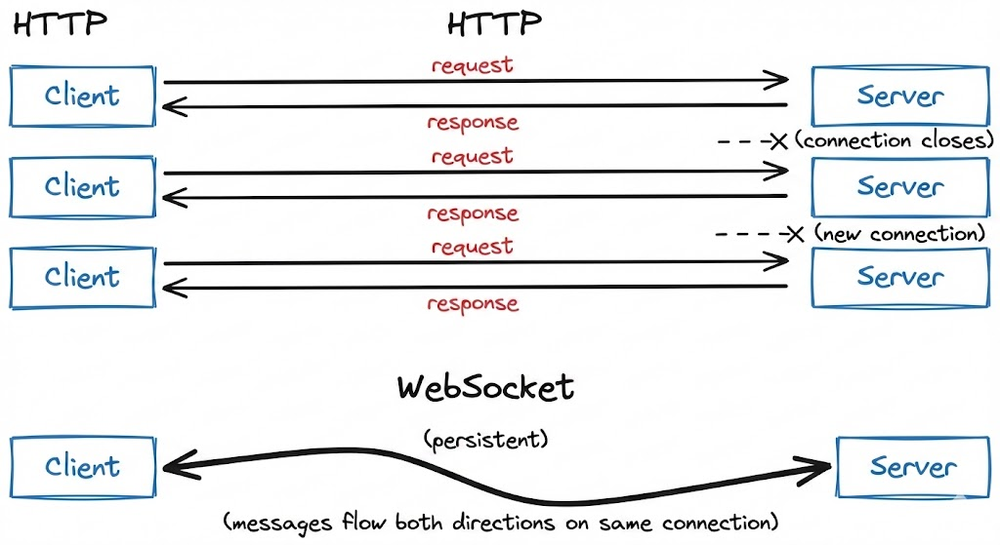

# 3. How OpenEnv environments scale

This section covers benchmarking and scaling OpenEnv environments.

**Contents:**
- [Provider Scaling](#provider-scaling)
- [WebSocket-based Scaling](#websocket-based-scaling)
- [Microservice Scaling](#microservice-scaling)
- [Scaling Experiments](#scaling-experiments)

---

## Provider Scaling

The easiest way to scale an OpenEnv environment is to use a `provider` these are abstractions based on runtimes like Uvicorn, Docker Swarm, or Kubernetes.

```python
from openenv.providers import UVProvider, DockerSwarmProvider, LocalDockerProvider

docker_provider = LocalDockerProvider() # default
uvicorn_provider = UVProvider() # python only
swarm_provider = DockerSwarmProvider() 

with EchoEnv.from_hub(
    repo_id="openenv/echo-env", 
    provider=swarm_provider, 
    replicas=4,
) as env:
  result = env.reset()
  result = env.step(EchoAction(message="Hello"))
```

## WebSocket-based Scaling

OpenEnv uses WebSocket connections (`/ws`) instead of stateless HTTP for environment interactions. This design enables efficient scaling within a single container.

### What are WebSockets?

WebSocket is a communication protocol that provides a persistent, bidirectional connection between client and server. Unlike HTTP—where each request opens a new connection, sends data, receives a response, and closes—a WebSocket connection stays open for the duration of a session.



For RL environments, this matters because a typical episode involves dozens to thousands of sequential `step()` calls. With HTTP, each step incurs TCP handshake overhead (~10-50ms). With WebSocket, messages are sent as lightweight frames (~0.1ms overhead) over the existing connection.

Also, with HTTP, long running sessions require logic to manage session state, which is not necessary with WebSocket.

### Multiple sessions per container

With HTTP, maintaining session state requires cookies or session IDs with every request. Each isolated environment instance typically needs its own container:

```
HTTP approach: N parallel episodes → N containers
```

> [!NOTE]
> This is completely fine (and ideal) for larger deployments where containers can be scaled. But if your resources are constrained, this add loads of overhead.

With WebSocket, **one container handles many isolated sessions**. Each WebSocket connection gets its own environment instance server-side:

```python
# Single container serving multiple concurrent sessions
# docker run -d -p 8000:8000 my-env:latest

# Each client gets an isolated environment instance
with MyEnv(base_url="http://localhost:8000") as env1:  # Session 1
    result = env1.reset()
    
with MyEnv(base_url="http://localhost:8000") as env2:  # Session 2
    result = env2.reset()
    
with MyEnv(base_url="http://localhost:8000") as env3:  # Session 3
    result = env3.reset()
```

> [!NOTE]
> This has its own advantages and disadvantages. For example: Separation of concerns and fault tolerance in environments like coding or terminal.

### Server-side session state

The server maintains environment state per WebSocket connection which means that the environment builder does not need to worry about session state.

- No session IDs because Connection itself is the session
- Automatic cleanup because Environment instance destroyed when connection closes
- Isolation guaranteed because Each connection has dedicated state

```python
# Server creates new environment instance per WebSocket connection
@app.websocket("/ws")
async def websocket_endpoint(websocket: WebSocket):
    env = MyEnvironment()  # Fresh instance per connection
    await websocket.accept()
    
    while True:
        data = await websocket.receive_json()
        if data["type"] == "reset":
            result = env.reset()
        elif data["type"] == "step":
            result = env.step(data["action"])
        await websocket.send_json(result)
```

### Resource efficiency

| Approach | Containers | Memory | Startup | Max parallel |
|----------|------------|--------|---------|--------------|
| HTTP (1 env = 1 container) | N | N × ~100MB | N × ~5s | Limited by containers |
| WebSocket (N sessions = 1 container) | 1 | ~200MB | ~5s | Limited by `MAX_CONCURRENT_ENVS` |

Configure session limits via environment variable:

```bash
docker run -d -p 8000:8000 -e MAX_CONCURRENT_ENVS=100 registry.hf.space/openenv-echo-env:latest
```

## Scaling a Single Container

Before adding more containers, maximize the capacity of a single deployment. The key parameters are **workers** (CPU parallelism) and **MAX_CONCURRENT_ENVS** (session limit).

### Uvicorn workers

Each Uvicorn worker is a separate process that can handle requests independently. More workers = more CPU cores utilized.

```bash
# Clone and run locally
git clone https://huggingface.co/spaces/burtenshaw/openenv-benchmark
cd openenv-benchmark
pip install -e .

# Run with 8 workers
WORKERS=8 uvicorn benchmark.server.app:app --host 0.0.0.0 --port 8000 --workers 8
```

The above example will use 8 workers and each worker will be able to handle 100 concurrent sessions. **For simple environments, like text games, it's possible to get to 2000 concurrent sessions with 8 workers.**

> **Note:** More workers consume more memory. Each worker loads a full copy of the environment code.

### Docker with environment variables

Pass scaling parameters when starting the container:

```bash
# Pull from HF Spaces registry
docker pull registry.hf.space/burtenshaw-openenv-benchmark:latest

# Run with custom configuration
docker run -d -p 8000:8000 \
    -e WORKERS=8 \
    -e MAX_CONCURRENT_ENVS=400 \
    --name openenv-benchmark \
    registry.hf.space/burtenshaw-openenv-benchmark:latest
```

| Variable | Default | Description |
|----------|---------|-------------|
| `WORKERS` | 4 | Uvicorn worker processes |
| `MAX_CONCURRENT_ENVS` | 100 | Max WebSocket sessions per worker |
| `PORT` | 8000 | Server port |
| `HOST` | 0.0.0.0 | Bind address |

### HF Spaces configuration

Now, let's deploy the environment to HF Spaces so that we can interact with the server from the client. Configure scaling via Space Settings > Variables:

1. Go to your Space settings page
2. Add environment variables:
   - `WORKERS=4` (max 4 on free tier, 8 on CPU Upgrade)
   - `MAX_CONCURRENT_ENVS=100`
3. Restart the Space

| Tier | vCPU | Recommended workers | Expected max batch (textarena) |
|------|------|--------------------|--------------------|
| CPU Basic (Free) | 2 | 2 | ~128 |
| CPU Upgrade | 8 | 4-8 | ~512 |

> **Limitation:** HF Spaces free users tier caps at ~128 concurrent sessions regardless of configuration. See [Scaling Experiments](#scaling-experiments) for measured limits. 

### Scaling limits

The experiments below found that even on larger instances, a single container eventually fails to scale and we need multiple containers to handle the load. For example, on a CPU Upgrade instance with 8 workers, the max batch was 1024 concurrent sessions:

- Success rate drops to 92%
- P99 latency exceeds 2× the expected step time
- Connection errors increase under load

When this happens, we need to scale to multiple containers and use a load balancer.

For high-throughput workloads, scale horizontally by running multiple environment containers behind a load balancer.

| Scenario | Recommended approach |
|----------|---------------------|
| Development / testing | Single container with WebSocket sessions |
| Moderate load (< 100 concurrent) | Single container, increase `MAX_CONCURRENT_ENVS` |
| High load (100+ concurrent) | Multiple containers + load balancer |
| GPU environments | One container per GPU |

We explored this in detail in the [Scaling Experiments](https://github.com/burtenshaw/openenv-scaling) repository.

<details>
<summary>Envoy configuration</summary>

```yaml
static_resources:
  listeners:
    - name: listener_0
      address:
        socket_address:
          address: 0.0.0.0
          port_value: 8080
      filter_chains:
        - filters:
            - name: envoy.filters.network.http_connection_manager
              typed_config:
                "@type": type.googleapis.com/envoy.extensions.filters.network.http_connection_manager.v3.HttpConnectionManager
                stat_prefix: ingress_http
                upgrade_configs:
                  - upgrade_type: websocket
                route_config:
                  name: local_route
                  virtual_hosts:
                    - name: openenv_service
                      domains: ["*"]
                      routes:
                        - match:
                            prefix: "/"
                          route:
                            cluster: openenv_cluster
                http_filters:
                  - name: envoy.filters.http.router
                    typed_config:
                      "@type": type.googleapis.com/envoy.extensions.filters.http.router.v3.Router

  clusters:
    - name: openenv_cluster
      connect_timeout: 30s
      type: STRICT_DNS
      lb_policy: ROUND_ROBIN
      load_assignment:
        cluster_name: openenv_cluster
        endpoints:
          - lb_endpoints:
              - endpoint:
                  address:
                    socket_address:
                      address: host.docker.internal
                      port_value: 8001
              - endpoint:
                  address:
                    socket_address:
                      address: host.docker.internal
                      port_value: 8002
              - endpoint:
                  address:
                    socket_address:
                      address: host.docker.internal
                      port_value: 8003
              - endpoint:
                  address:
                    socket_address:
                      address: host.docker.internal
                      port_value: 8004
```


Start Envoy:

```bash
docker run -d \
    -p 8080:8080 \
    -v $(pwd)/envoy.yaml:/etc/envoy/envoy.yaml \
    --add-host=host.docker.internal:host-gateway \
    envoyproxy/envoy:v1.28.0
```

Connect through the load balancer:

```python
# Clients connect to Envoy, which distributes to backend containers
with MyEnv(base_url="http://localhost:8080") as env:
    result = env.reset()
```

</details>

### Scaling expectations


| Setup | Containers | Sessions/container | Total capacity | Throughput |
|-------|------------|-------------------|----------------|------------|
| Single | 1 | 100 | 100 | ~100 req/s |
| 4× containers | 4 | 100 | 400 | ~350 req/s |
| 8× containers | 8 | 100 | 800 | ~600 req/s |

> **Note:** Actual throughput depends on environment complexity and hardware. Benchmark your specific workload.

## Experiments Results

This section documents experiments measuring OpenEnv scaling characteristics across five infrastructure configurations. Full experiment data and code available at [burtenshaw/openenv-scaling](https://github.com/burtenshaw/openenv-scaling).

### Experiment setup

**Benchmark environment:** A minimal OpenEnv environment with configurable wait time (simulates computation). Each `step()` call sleeps for the specified duration, isolating infrastructure overhead from environment logic.

**Infrastructure tested:**

| Infrastructure | Cores | Configuration |
|----------------|-------|---------------|
| local-uvicorn | 8 | Direct Uvicorn, 8 workers |
| local-docker | 8 | Docker container from HF Spaces image |
| hf-spaces | 2 | HF Spaces free tier (cpu-basic) |
| slurm-single | 48 | Single AWS HPC node |
| slurm-multi | 96 | Two AWS HPC nodes + Envoy load balancer |

**Protocol:** WebSocket (`/ws`) and HTTP (`/reset`, `/step`) compared where available.

**Metrics:**
- **Max batch:** Largest concurrent request count with ≥95% success rate
- **Batch/core:** Max batch divided by available cores (efficiency metric)
- **P99 latency:** 99th percentile total request time
- **RPS:** Requests per second at max batch

### Results summary

| Infrastructure | Max Batch (WS) | Cores | Batch/Core | P99 Latency | RPS |
|----------------|----------------|-------|------------|-------------|-----|
| slurm-multi | 16,384 | 96 | 170.7 | 29.8s | 518 |
| local-uvicorn | 2,048 | 8 | 256.0 | 1.97s | 932 |
| local-docker | 2,048 | 8 | 256.0 | 2.90s | 682 |
| slurm-single | 512 | 48 | 10.7 | 1.45s | 358 |
| hf-spaces | 128 | 2 | 64.0 | 2.68s | 48 |

All results measured with `wait=10.0s` step duration.


*Maximum batch size by infrastructure (95% success threshold)*

### Finding 1: Local deployments have highest per-core efficiency

Single instance of Python and Docker both achieve **256 concurrent sessions per core**—the highest efficiency observed. With 8 workers, both reach 2,048 concurrent sessions before degradation begins.

This makes sense because the environment is running in a single process and the overhead of the environment is relatively low. But it's ideal for hackers and developers who want to test their environment quickly or train on a single machine.

| Batch Size | Success Rate | P99 Latency | Notes |
|------------|--------------|-------------|-------|
| 32 | 100% | 1.05s | Perfect scaling |
| 128 | 100% | 1.07s | Perfect scaling |
| 512 | 100% | 1.33s | Perfect scaling |
| 2,048 | 96.5% | 1.97s | Max reliable batch |
| 4,096 | 63.8% | 3.20s | Connection failures begin |
| 8,192 | 36.9% | 5.75s | Above capacity |

Beyond 2,048 concurrent connections, success rate drops sharply. The failure mode is connection rejection, not timeout—the server saturates its connection pool.


*Per-core efficiency comparison across infrastructures*

### Finding 2: HF Spaces works reliably up to 128 concurrent sessions

HF Spaces free tier (cpu-basic) provides 2 workers and achieves 128 concurrent WebSocket sessions with 100% success. This translates to **64 sessions per core**.

**HF Spaces scaling behavior (WebSocket):**

| Batch Size | Success Rate | P99 Latency | Notes |
|------------|--------------|-------------|-------|
| 1 | 100% | 1.64s | Baseline |
| 32 | 100% | 1.80s | Perfect scaling |
| 64 | 100% | 2.14s | Perfect scaling |
| 128 | 100% | 2.68s | Max reliable batch |
| 256 | ~33% | 4.41s | Inconsistent (some runs 0%, some 100%) |
| 512 | 0% | — | Complete failure |

At 256 concurrent connections, results become unstable. At 512+, connections fail entirely due to HF Spaces connection limits.

**HTTP mode does not work on HF Spaces.** The `/reset` and `/step` HTTP endpoints are not accessible on the deployed Space—all HTTP requests fail. Use WebSocket mode exclusively.

### Finding 3: Multi-node scaling works

Multi-node SLURM (96 cores across 2 nodes) achieves **16,384 concurrent sessions** with 100% success rate—the highest absolute throughput tested.

**SLURM multi-node scaling behavior:**

| Batch Size | Success Rate | P99 Latency | Notes |
|------------|--------------|-------------|-------|
| 32 | 100% | 1.05s | Perfect scaling |
| 512 | 100% | 1.59s | Perfect scaling |
| 2,048 | 100% | 3.48s | Perfect scaling |
| 4,096 | 100% | 6.97s | Perfect scaling |
| 8,192 | 100% | 13.7s | Perfect scaling |
| 16,384 | 100% | 29.8s | Max tested batch |

The batch/core ratio (170.7) is lower than local deployments (256) but provides the highest absolute capacity for large-scale workloads.


*Multi-node vs single-node scaling behavior*

### Latency breakdown

At max load (`wait=1.0s`), latency breaks down as:

| Infrastructure | Connect P50 | Reset P50 | Step P50 | Total P99 |
|----------------|-------------|-----------|----------|-----------|
| slurm-single | 0.26s | 0.04s | 1.00s | 1.33s |
| local-uvicorn | 0.58s | 0.08s | 1.05s | 1.95s |
| hf-spaces | 0.79s | 0.10s | 1.10s | 2.48s |
| local-docker | 1.38s | 0.19s | 1.05s | 2.90s |
| slurm-multi | 17.5s | 2.25s | 2.42s | 26.3s |

**Observations:**
- **Step latency** is consistent across infrastructures (~1.0s for 1.0s wait), confirming the benchmark measures infrastructure overhead accurately
- **Connect latency** varies significantly—local Docker shows higher connect time at load (1.38s), likely due to container networking
- **Multi-node has high connect latency** (17.5s) at 16,384 batch due to queuing at the load balancer; this is the cost of handling 16× more connections than single-node


*P99 latency across configurations and batch sizes*


*Success rate vs batch size for all infrastructures*

### Test methodology

```bash
# Clone benchmark environment
git clone https://huggingface.co/spaces/burtenshaw/openenv-scaling
cd openenv-scaling

# Run scaling test
python tests/test_scaling.py \
    --url http://localhost:8000 \
    --requests-grid 32,128,512,2048,4096,8192,16384 \
    --wait-grid 1.0,5.0,10.0 \
    --reps 3 \
    --mode ws \
    --output-dir experiments/results/
```

Each configuration was tested with 3 repetitions. Max batch is defined as the largest batch size achieving ≥95% success rate across all repetitions.

---

## Summary

| Infrastructure | Best for | Max concurrent | Batch/core |
|----------------|----------|----------------|------------|
| local-uvicorn | Development, <2K sessions | 2,048 | 256 |
| local-docker | Same as uvicorn, containerized | 2,048 | 256 |
| hf-spaces | Demos, moderate load | 128 | 64 |
| slurm-single | HPC, single-node jobs | 512 | 10.7 |
| slurm-multi | Large-scale training | 16,384 | 170.7 |

**Recommendations:**

1. **For development and moderate workloads (<2,000 concurrent):** Use single node Uvicorn or Docker depending software environment. These provide the best per-core efficiency (256 sessions/core).

2. **For demos, testing, and published environments:** HF Spaces free tier works reliably up to 128 concurrent sessions.

3. **For large-scale training (>2,000 concurrent):** Deploy multi-node with proper load balancing. Expect ~170 sessions per core, but much higher absolute throughput.
