# RFC: MCP (Model Context Protocol) Support

**Status**: In Review **Created**: 10/21/2025 **Amended**: November 15, 2025 **Authors**: @Darktex, @pankit-eng **RFC ID:** 003

## Amendment History

**November 12, 2025**:

- Restructured to start with MCP primer showing REST-like API (tools/list, tools/call)
- Added Traditional MCP Interface section with ListToolsAction and CallToolAction
- Mentioned resources and prompts in passing (focused on tools)
- Moved progressive disclosure to FAQ (MCP protocol layer concern)
- Made Docker Compose deployment pattern explicitly optional
- Added FAQ section for common questions
- Removed CodeAct content (moved to RFC 004\)

**Note on RFC 007**: MCP Protocol Interception will define how to intercept MCP calls at the protocol layer for observability, monitoring, and metadata injection. This enables features like logging all tool calls, injecting performance metadata (see RFC 006), and A/B testing tool implementations.

## Summary

This RFC defines how OpenEnv integrates with MCP (Model Context Protocol) to expose external tools to agents using traditional tool calling. We map MCP's REST-like API (tools/list, tools/call) to Gym-style action types, creating a standardized interface for tool discovery and invocation.

To limit the focus on finalizing the API interface, we are intentionally choosing to focus only on local MCP tools via this RFC (and respective changes). This means that any MCP tool shall be packaged inside the OpenEnv sandbox (docker container) for the purpose of this RFC.

## Problem Statement

Modern AI agents need access to tools (web search, file operations, database queries, etc.). OpenEnv environments follow the Gym-style specifications with defined action spaces. We need a standardized way to surface tools as part of the environment's interface to policy for RL training and at the same time, use the same tools during inference.

## High Level Approach

There are primarily two problems in relation to tools that we want to solve with this proposal.

1. Action Discovery: This entails the mechanism & interface by which RL training code as well as inference discovers the tools available at its disposal.
2. Actions & Tool Calling: This entails the mechanism & interface by which RL training code as well inference calls the tools it discovered as part of Tool discovery.

In terms of design principles, we want to approach this with:

1. **Be as close as possible to MCP protocol** when it comes to tool support in OpenEnv. This reduces the barrier for adoption.
2. **Minimize the difference between training vs inference**. This helps achieve the same or expected level of performance from the agents.
3. **Continue supporting simple gym-style APIs for RL** but augment where needed to support the same env in inference.

### Proposed Solution

We propose to **adopt** the MCP interface for **all actions exposed to the Agent** in OpenEnv. Note that this does **not** include what we instead expose to the training/serving infrastructure (the control plane), which we will talk about later.

While not every action may use what we could call “tools”, the general need to list all possible actions and to execute one overlaps exactly with MCP. So, this RFC proposes to just standardize on the MCP protocol for all actions as providing a consistent interface helps models.

There are two ways to perform actions:

1. **Tool-calling** makes a single tool call per agent action (and thus env step)
2. **CodeAct** allows the agent to write code blocks as an action and exposes tools as methods callable within the code block, thus enabling multiple tool call per single action

Our proposal supports both: Env builders will **build once** and will be compatible with either style out of the box.

Let’s go through some scenarios.

#### Scenario 1: Perform actions/call MCP tools (they become the same thing)

| Tool call style | CodeAct style |
| :---- | :---- |
|  `obs = env.step(     ToolCallAction(         tool="read_text_file",         path="~/file.txt",         head=100     ) ) `  |  `obs = env.step(     CodeAction(""" text = read_text_file('~/file.txt', head=100) return [l for l in text.split("\n") if "needle" in l] """) )`   |

#### Scenario 2: Discover actions/MCP tools (they become the same thing)

| Tool call style | CodeAct style |
| :---- | :---- |
|  `obs = env.step(ListToolsAction()) # obs contains the list. We provide this action for you, you don't have to code it.`  | There is only one action: `CodeAction`, but you can call `list_tools()` as a function inside it. `obs = env.step(     CodeAction(""" return [t for t in list_tools() if 'browser' in t] """) )  `  Again, we will do this plumbing for you. |

#### Scenario 3: I already have my own MCP client for inference

A lot of what `env.step()` provides can be performed by an MCP client, assuming you don't care about the other things we do like e.g. reward computation, evals etc (which you probably don't in prod). In this case, we expose an MCP endpoint alongside the existing HTTP API.

  **Transport:**

* We reuse the same HTTP transport via fastAPI that we are using for the Env to also expose the MCP server (content will follow MCP's JSON-RPC message format).
  * NOTE: MCP’s default transport protocols are stdio and streamable HTTP. However, [Custom transport protocols](https://modelcontextprotocol.io/specification/2025-06-18/basic/transports#custom-transports) are allowed and still in-spec.
* Future: We plan to support standard Streamable HTTP transport to reduce latency and be more aligned with the spec.

```py
# Environment exposes both interfaces
  env = MyEnvironment()
  app = create_fastapi_app(env, action_cls, observation_cls)

  # Training/Eval: Use step API
  POST http://localhost:8000/step
  {"action": {...}}

  # Production/Inference: Use MCP API
  POST http://localhost:8000/mcp
  {"jsonrpc": "2.0", "method": "tools/list", "id": 1}

  POST http://localhost:8000/mcp
  {"jsonrpc": "2.0", "method": "tools/call", "params": {"name": "...", "arguments": {...}}, "id": 2}
```


  Limitations (to be addressed later):
  \- No SSE streaming (single request/response only)
  \- No server-initiated messages
  \- No session management
  \- These will be added when we implement standard Streamable HTTP transport

## CodeAct-specific performance improvement for local MCP servers {#codeact-specific-performance-improvement-for-local-mcp-servers}

MCP is a client-server architecture that requires JSON-RPC for cross-process communication. This design maps naturally to remote MCP servers and tool calling-style. When we go into CodeAct-style, there’s an extra issue to think about whenever the MCP server is local: **double-marshaling**.

If you write a Python function for local execution, e.g. `fibonacci(n)`, and then decorate it with a fastmcp `@mcp.tool` decorator, you can then expose it via MCP to the fastMCP server. This means that this function will now take RPCs and will marshal types from Python → JSON-RPC. If you then want to use CodeAct, you want to pass this MCP tool to a Python interpreter for local execution, thus doing another conversion JSON-RPC → Python\! You did a whole round trip just to come back to square one.

Existing implementations of MCP \+ CodeAct from [Anthropic](https://www.anthropic.com/engineering/code-execution-with-mcp) and [CloudFlare](https://blog.cloudflare.com/code-mode/) do not address this, but they likely have more remote MCP servers (while we focus on local MCP servers at this stage). Many of our environments come from gym-style, no-tool envs for RL, which will translate into becoming local MCP servers. With CodeAct becoming mainstream, performance becomes a concern for us.

### Proposal: use introspection?

We can build a MCP server similar to FastMCP, but with the ability to register local tool calls, e.g.

```py
from mcp.server import Server

  class LocalMCPServer:
      def __init__(self):
          self.mcp = Server("myserver")
          self._callables = {}  # Store underlying functions

      def tool(self, func):
          """Decorator that registers both MCP tool AND stores callable"""
          # Store the actual Python function
          self._callables[func.__name__] = func

          # Also register for MCP protocol
          @self.mcp.call_tool()
          async def mcp_handler(name: str, arguments: dict):
              if name == func.__name__:
                  return func(**arguments)

          return func

      def get_callables(self) -> dict[str, Callable]:
          """Return dict of {function_name: function}"""
          return self._callables.copy()

  # Define tools
  server = LocalMCPServer()

  @server.tool
  def fibonacci(n: int) -> int:
      if n <= 1: return n
      return fibonacci(n-1) + fibonacci(n-2)

```

Then we can inject these functions into the namespace of the Python interpreter:

```py
class CodeActEnvironment:
      def __init__(self):
          self.mcp_server = self._create_mcp_server()

      def _get_local_tools_as_callables(self) -> dict[str, Callable]:
          """Extract Python callables from local MCP server"""
          tools = {}

          # Introspect the MCP server to get underlying Python functions
          # (assumes local MCP server exposes this - see above)
          for tool_name, func in self.mcp_server.get_callables().items():
              tools[tool_name] = func

          return tools

      def execute_code(self, code: str):
          """Execute agent's code with tools injected directly"""

          # Build execution namespace with tools as direct functions
          namespace = self._get_local_tools_as_callables()

          # Agent's code now has direct access!
          exec(code, namespace)

          return namespace.get('result')  # Or however you capture output

```

Of course, **remote** MCP servers would go through the standard route – even if they are written in Python, there isn’t much we can do since we need to send data over the wire anyway. This optimization only applies to local servers—remote MCP servers will continue to use the standard protocol since data must be serialized over the network anyway. This approach preserves MCP's benefits for tool discovery and model prompting while eliminating redundant marshaling for local execution.

## Design

### Architecture Overview \- Tool-call mode


### Architecture Overview \- CodeAct mode

```mermaid
flowchart TB
    Inference["Inference Server
    (e.g., vLLM)"]

    subgraph icp["Infrastructure Control Plane"]
        Reset["Use Case 1:
        Reset Environment"]
        RunStep["Use Case 2:
        Run Agent Step
        (CodeAct Mode)"]
        DirectMCP["Use Case 3:
        Call Tool Directly
        (Alternative Flow)"]
    end

    subgraph container["OpenEnv Container"]
        ResetEndpoint["reset()"]

        StepEndpoint["step()

        Code Sandbox + Reward"]

        ParentMCP["Parent MCP Server
        (composition)"]

        subgraph local["Local Child Servers
        (Direct Python calls)"]
            FS["Filesystem
            ⚡ Direct callable"]
            Git["Git
            ⚡ Direct callable"]
            Python["Python REPL
            ⚡ Direct callable"]
        end

        subgraph remote["Remote Child Servers
        (JSON-RPC)"]
            Slack["Slack API
            🌐 JSON-RPC"]
            External["External APIs
            🌐 JSON-RPC"]
        end
    end

    %% Use Case 1: Reset
    Reset -->|"POST /reset"| ResetEndpoint

    %% Use Case 2: Agent Step (CodeAct)
    RunStep -->|"request text"| Inference
    Inference -->|"generated Python code"| RunStep
    RunStep -->|"POST /step
    (with code)"| StepEndpoint
    StepEndpoint -->|"Observation
    + Reward"| RunStep

    %% Use Case 3: Direct MCP (Alternative)
    DirectMCP -.->|"POST /mcp
    (bypass step)"| ParentMCP

    %% Code execution - local direct calls (NO JSON-RPC)
    StepEndpoint -->|"Direct Python call
    NO marshaling"| FS
    StepEndpoint -->|"Direct Python call
    NO marshaling"| Git
    StepEndpoint -->|"Direct Python call
    NO marshaling"| Python

    %% Code execution - remote JSON-RPC
    StepEndpoint -->|"JSON-RPC
    from within code"| Slack
    StepEndpoint -->|"JSON-RPC
    from within code"| External

    %% All servers registered with Parent
    FS -->|"registered"| ParentMCP
    Git -->|"registered"| ParentMCP
    Python -->|"registered"| ParentMCP
    Slack -->|"registered"| ParentMCP
    External -->|"registered"| ParentMCP

    %% Styling
    classDef icpBox fill:#d6eaff,stroke:#0066cc,stroke-width:3px
    classDef useCaseBox fill:#e3f2fd,stroke:#1976d2,stroke-width:1px
    classDef inferenceBox fill:#fff3e0,stroke:#f57c00,stroke-width:2px
    classDef containerBox fill:#fffacd,stroke:#ff9800,stroke-width:3px
    classDef endpointBox fill:#f3e5f5,stroke:#9c27b0,stroke-width:2px
    classDef localBox fill:#e8f5e9,stroke:#4caf50,stroke-width:2px
    classDef remoteBox fill:#e3f2fd,stroke:#2196f3,stroke-width:2px

    class Inference inferenceBox
    class Reset,RunStep,DirectMCP useCaseBox
    class ResetEndpoint,StepEndpoint,ParentMCP endpointBox
    class FS,Git,Python localBox
    class Slack,External remoteBox
```



### Frequently Asked Questions

### FAQ 001\. How do we handle progressive disclosure with 100+ tools?

Progressive disclosure (showing a subset of tool schemas to save context) is handled at the **MCP protocol layer**, not by OpenEnv. MCP servers can implement progressive disclosure patterns, and MCP clients can provide `get_tool_schema()` meta-tools for on-demand schema loading.

OpenEnv simply consumes MCP's `list_tools()` and `call_tool()` APIs. How the MCP server manages tool schemas internally is outside our scope.

**Resources**:

- [MCP Specification on Resource Discovery](https://spec.modelcontextprotocol.io/)
- Future work (RFC 007\) will explore MCP protocol interception for caching and metadata injection

### FAQ 002\. Wait, so every action is a “tool” now?\!

Yes. So, if e.g. you are playing a game of chess, moving pieces becomes a “tool” of sorts. Ultimately what MCP considers a “tool” is simply a function, so as long as you had a function before, you are just a Python decorator away from migrating to this brand new world. What you get is worth it as models are primed to call MCP servers, so they benefit from this standardization as it’s much more in distribution. We propose a [way](#codeact-specific-performance-improvement-for-local-mcp-servers) to mitigate performance impact of this while on local MCP servers.

### FAQ 003\. How many servers do you have?

It’s up to env builders to decide how many servers they want to expose – ultimately, it’s a question of how you want to group your tools.

However, we should expose **a single MCP server** by combining them as appropriate: FastMCP (and most MCP implementations) support [composition](https://gofastmcp.com/servers/composition) for this reason.

# Appendix

### MCP Primer: What We Need to Implement

The [Model Context Protocol (MCP)](https://modelcontextprotocol.io/) is an open standard that provides a REST-like API for AI agents to interact with external systems. To be MCP-compliant, we need to implement a client that can communicate with MCP servers.

#### Core MCP APIs

MCP servers expose three main capabilities through JSON-RPC:

##### 1\. Tools (Primary Focus)

Tools are functions that agents can call to perform actions or retrieve information.

**Discovery**: `tools/list`

```json
{
  "jsonrpc": "2.0",
  "method": "tools/list",
  "id": 1
}
```

**Response**:

```json
{
  "jsonrpc": "2.0",
  "result": {
    "tools": [
      {
        "name": "search_web",
        "description": "Search the web for information",
        "inputSchema": {
          "type": "object",
          "properties": {
            "query": { "type": "string" },
            "max_results": { "type": "integer", "default": 5 }
          },
          "required": ["query"]
        }
      }
    ]
  },
  "id": 1
}
```

**Invocation**: `tools/call`

```json
{
  "jsonrpc": "2.0",
  "method": "tools/call",
  "params": {
    "name": "search_web",
    "arguments": {
      "query": "python patterns",
      "max_results": 5
    }
  },
  "id": 2
}
```

**Full specification**: [MCP Tools API](https://modelcontextprotocol.io/specification/2025-06-18/server/tools)

##### 2\. Resources (Secondary \- mentioned for completeness)

Resources provide read-only data that agents can access (files, database queries, API responses, etc.).

- `resources/list` \- Discover available resources
- `resources/read` \- Read resource contents

**Full specification**: [MCP Resources API](https://modelcontextprotocol.io/specification/2025-06-18/server/resources)

##### 3\. Prompts (Secondary \- mentioned for completeness)

Prompts are reusable prompt templates that agents can retrieve and instantiate.

- `prompts/list` \- Discover available prompts
- `prompts/get` \- Retrieve a prompt template

**Full specification**: [MCP Prompts API](https://modelcontextprotocol.io/specification/2025-06-18/server/prompts)

**Note**: This RFC focuses primarily on **tools** as they are the most common use case for agent-environment interaction. Resources and prompts are mentioned for completeness but will be addressed in future RFCs if needed.

#### Traditional MCP Interface: Function Calling

The most direct way to support MCP is to map the protocol directly to action types.

##### ListToolsAction and CallToolAction

We introduce two action types that correspond directly to MCP's API:

```py
@dataclass
class ListToolsAction(Action):
    """Request list of available tools from MCP servers."""
    pass  # No parameters needed

@dataclass
class CallToolAction(Action):
    """Call a specific tool via MCP."""
    tool_name: str
    parameters: Dict[str, Any]
```

##### How It Works

```py
# Agent discovers available tools
action = ListToolsAction()
obs = env.step(action)
# obs.tools = [
#   {"name": "search_web", "description": "...", "inputSchema": {...}},
#   {"name": "read_file", "description": "...", "inputSchema": {...}}
# ]

# Agent calls a tool
action = CallToolAction(
    tool_name="search_web",
    parameters={"query": "python patterns", "max_results": 5}
)
obs = env.step(action)
# obs.result = {"results": [...]}
```

```py
from mcp_client import MCPClient

class MCPEnvironment(Environment):
    def __init__(self, mcp_server_urls: list[str]):
        self.mcp_clients = [MCPClient(url) for url in mcp_server_urls]

    def step(self, action: Action) -> Observation:
        if isinstance(action, ListToolsAction):
            # Call tools/list on all MCP servers
            all_tools = []
            for client in self.mcp_clients:
                tools = client.list_tools()
                all_tools.extend(tools)

            return Observation(
                done=False,
                metadata={"tools": all_tools}
            )

        elif isinstance(action, CallToolAction):
            # Find the right MCP server and call tools/call
            for client in self.mcp_clients:
                if client.has_tool(action.tool_name):
                    result = client.call_tool(
                        name=action.tool_name,
                        arguments=action.parameters
                    )
                    return Observation(
                        done=False,
                        metadata={"result": result}
                    )

            raise ValueError(f"Tool '{action.tool_name}' not found")
```

This approach is **immediately MCP-compliant** \- we're just exposing the MCP REST API as Gym-style actions.

## Open Questions

1. **Caching**: Should we cache tool results, and if so, what's the invalidation strategy?
2. **Streaming**: How to handle streaming responses from MCP servers (e.g., long-running operations)?
3. **Error Handling**: Should MCP errors be propagated as exceptions or returned in observations?
4. **Versioning**: How to handle version compatibility between MCP clients and servers?

**Note**: Observability and protocol-level interception for MCP will be addressed in RFC 007 (MCP Protocol Interception), which will define patterns for monitoring, logging, and metadata injection at the MCP protocol layer.

## References

- [Model Context Protocol Specification](https://spec.modelcontextprotocol.io/)
- [FastMCP Python Library](https://github.com/jlowin/fastmcp)
- [mcp-use Python Library](https://github.com/mcp-use/mcp-use)
- RFC 000: OpenEnv Project Phases
- RFC 001: OpenEnv Basic Abstractions
- RFC 002: OpenEnv Framework Spec
