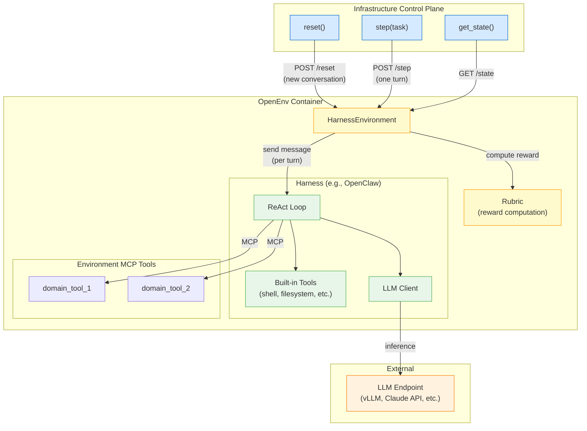
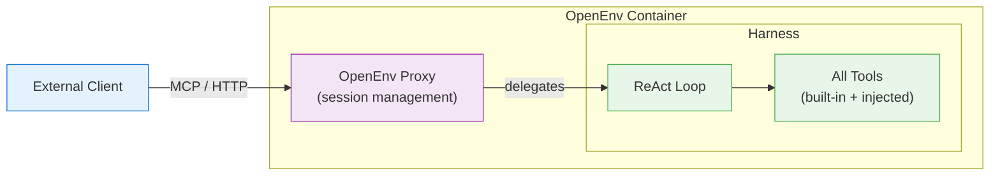

# RFC 005: Agentic Harness Integration

**Status**: In Review
**Created**: 2026-02-16
**Authors**: @Darktex
**RFC ID**: 005

## Summary

This RFC defines how OpenEnv integrates with external **agentic harnesses**—systems like OpenClaw, Claude Code, Gemini CLI, and Goose that combine tools, state, and an LLM inference loop (typically ReAct) into a unified control flow. The challenge is that a harness overlaps with an Environment in critical ways (tools, filesystem, state) but adds "brains" by owning the control loop—something environments do not have.

We propose a **wrapping pattern**: OpenEnv's container provides the filesystem and sandbox, the harness runs inside it, and any additional environment MCP tools are injected into the harness before the session starts. In production mode, OpenEnv gets out of the way and lets clients talk directly to the harness with streaming events. In simulation mode, the training loop retains episode control—each `step()` is one conversational turn, and the harness maintains context across turns within an episode.

OpenClaw is the first concrete integration to validate the pattern.

---

## Motivation

### Problem 1: Harnesses exist and they overlap with Environments

Modern AI agents increasingly work through harnesses—systems that own the ReAct loop, manage conversation history, and provide built-in tools (filesystem, shell, browser, etc.). These harnesses are not just tool collections; they are autonomous agents that orchestrate multi-step interactions with an LLM.

OpenEnv environments also own tools, filesystem state, and sandboxing. When you want to train or evaluate an agent that uses a harness, you hit a fundamental tension: who owns what?

### Problem 2: No standard integration pattern

Today, each harness integration would require ad-hoc plumbing. There's no standard way to:
- Inject additional MCP tools into a harness
- Run a harness inside an OpenEnv container
- Control episode boundaries when the harness owns the control loop
- Expose a harness in production mode

### Problem 3: Production mode needs rethinking

Currently, production mode degrades OpenEnv into a bare MCP server. When a harness is involved, we need to expose the harness itself—not just the MCP tools—because the harness *is* the agent interface. Clients want to talk to the harness, not to OpenEnv's step API.

### Goals

1. Define a clean abstraction for wrapping external harnesses
2. Enable MCP tool injection from environment into harness
3. Support both simulation (training) and production (inference) modes
4. Start concrete with OpenClaw, generalize from there
5. Remain backward-compatible: environments without harnesses work unchanged

---

## Design

### Key Insight: The Harness is the Agent, Not the Environment

In traditional OpenEnv, the agent is external—it calls `step()` with actions, gets observations back. The environment is passive: it responds to actions.

With a harness, the agent *lives inside* the environment. The harness owns the ReAct loop: it calls the LLM, interprets the response, invokes tools, and repeats. From the outside, each `step()` represents one **conversational turn**: the orchestrator sends a message, the harness does its internal ReAct loop (potentially many LLM calls and tool invocations) for that turn, and returns when it has a response.

```
Traditional OpenEnv:
  Training Loop → step(action) → Environment → observation
  (agent is external, one tool call per step)

With Harness:
  Training Loop → step(message) → Environment → Harness → [LLM ↔ Tools]* → response
  (agent is internal, one conversational turn per step)
  Training Loop → step(follow_up) → Environment → Harness → [LLM ↔ Tools]* → response
  (harness maintains conversation context across steps)
```

The harness maintains conversation context across `step()` calls. An episode spans multiple turns—the orchestrator sends messages, the harness responds, and this continues until the task is complete. The `reset()` call starts a fresh conversation.

### Architecture Overview



### Production Mode

In production mode, OpenEnv gets out of the way. The harness is exposed directly to clients:



OpenEnv's role in production mode:
1. **Session management**: Create/destroy harness sessions, enforce isolation
2. **Tool injection**: Plug environment MCP tools into the harness before session start
3. **Proxying**: Route client requests to the harness process
4. **Health & metrics**: Expose `/health`, `/metadata` endpoints

OpenEnv does NOT intercept the harness's tool calls or LLM interactions in production mode. It's purely an orchestration and setup layer.

### Core Abstractions

#### HarnessConfig

Configuration for an external harness. This is a Pydantic model that describes how to start and configure a harness process.

```python
from pydantic import BaseModel
from typing import Optional

class HarnessTransport(str, Enum):
    """How the harness exposes its interface."""
    STDIO = "stdio"           # stdin/stdout (most common for CLI harnesses)
    STREAMABLE_HTTP = "http"  # HTTP endpoint
    MCP = "mcp"               # Native MCP server

class HarnessConfig(BaseModel):
    """Configuration for an external agentic harness."""

    # Identity
    name: str                          # e.g., "openclaw", "claude-code"

    # Process management
    command: list[str]                 # e.g., ["openclaw", "run", "--model", "..."]
    working_directory: str = "/workspace"
    env_vars: dict[str, str] = {}      # Additional environment variables

    # Transport
    transport: HarnessTransport = HarnessTransport.STDIO

    # MCP tool injection
    mcp_config_path: Optional[str] = None  # Where to write MCP config for the harness
    # If None, auto-detected based on harness name

    # Timeouts
    startup_timeout_s: float = 30.0
    session_timeout_s: float = 600.0   # Max time for a single session/episode

    # LLM configuration (harness-specific)
    model: Optional[str] = None        # Override the harness's default model
    api_key_env_var: Optional[str] = None  # Env var name for LLM API key
```

#### HarnessAdapter (Abstract Base)

Adapters handle harness-specific lifecycle details. Each harness gets its own adapter.

```python
from abc import ABC, abstractmethod
from typing import AsyncIterator

class HarnessAdapter(ABC):
    """Abstract adapter for a specific harness implementation.

    Subclass this to integrate a new harness (OpenClaw, Claude Code, etc.).
    The adapter handles harness-specific startup, tool injection, and communication.

    The harness is a long-lived process that maintains conversation context.
    Each send_message() call is one conversational turn—the harness does its
    ReAct loop and returns when it has a response for the user.
    """

    def __init__(self, config: HarnessConfig):
        self.config = config

    @abstractmethod
    async def start(self, working_directory: str) -> None:
        """Start the harness process.

        Args:
            working_directory: Path where the harness should operate.
                              This is the container's workspace directory.
        """
        ...

    @abstractmethod
    async def stop(self) -> None:
        """Stop the harness process and clean up resources."""
        ...

    @abstractmethod
    async def inject_tools(self, tools: list[ToolDefinition]) -> None:
        """Inject MCP tool definitions into the harness configuration.

        This is called BEFORE start() so the harness discovers the tools
        at startup. The mechanism is harness-specific (config file,
        CLI flags, environment variable, etc.).

        Args:
            tools: List of MCP tool definitions to inject.
        """
        ...

    @abstractmethod
    async def send_message(self, message: str) -> HarnessResponse:
        """Send a message to the harness and get the response.

        This triggers one conversational turn. The harness will:
        1. Send the message to the LLM
        2. Execute tool calls as needed
        3. Return when it has a response (waiting for the next user message)

        The harness maintains conversation context across calls.
        Multiple send_message() calls form a multi-turn conversation.

        Args:
            message: The user message for this conversational turn.

        Returns:
            HarnessResponse containing the text response and turn events.
        """
        ...

    @abstractmethod
    async def send_message_streaming(
        self, message: str
    ) -> AsyncIterator[HarnessEvent]:
        """Send a message and stream intermediate events.

        Same semantics as send_message(), but yields HarnessEvents as
        they happen (tool calls, LLM chunks, etc.) rather than waiting
        for the complete response. The final event is always a
        HarnessEvent with type=TURN_COMPLETE.

        This is the natural interface since harnesses already stream
        to a terminal. We surface that stream to the caller.

        Args:
            message: The user message for this conversational turn.

        Yields:
            HarnessEvent instances as the harness processes the turn.
        """
        ...

    @abstractmethod
    async def is_alive(self) -> bool:
        """Check if the harness process is still running."""
        ...
```

#### Trajectory and Event Format

Harnesses produce a stream of events as they process each turn. We define a standard event schema that concrete adapters map their native formats to.

```python
class HarnessEventType(str, Enum):
    """Types of events emitted during a harness turn."""
    LLM_REQUEST = "llm_request"      # Message sent to the LLM
    LLM_RESPONSE = "llm_response"    # Complete LLM response received
    LLM_CHUNK = "llm_chunk"          # Streaming LLM token/chunk
    TOOL_CALL = "tool_call"          # Harness invoked a tool
    TOOL_RESULT = "tool_result"      # Tool returned a result
    TEXT_OUTPUT = "text_output"      # Harness emitted text (e.g., to terminal)
    ERROR = "error"                  # Error during processing
    TURN_COMPLETE = "turn_complete"  # Turn finished, harness awaits next message

class HarnessEvent(BaseModel):
    """A single event from a harness turn."""
    type: HarnessEventType
    timestamp: float                   # Unix timestamp
    data: dict[str, Any] = {}          # Event-type-specific payload

    # Payloads by type:
    # LLM_REQUEST:   {"messages": [...], "model": "..."}
    # LLM_RESPONSE:  {"content": "...", "usage": {...}}
    # LLM_CHUNK:     {"content": "...", "index": N}
    # TOOL_CALL:     {"tool_name": "...", "arguments": {...}}
    # TOOL_RESULT:   {"tool_name": "...", "result": "...", "error": null}
    # TEXT_OUTPUT:    {"text": "..."}
    # ERROR:         {"message": "...", "recoverable": bool}
    # TURN_COMPLETE: {"response": "..."}

class HarnessResponse(BaseModel):
    """Complete response from a single conversational turn."""
    response: str                      # The harness's text response
    events: list[HarnessEvent] = []    # All events from this turn
    done: bool = False                 # True if the harness considers the task complete
```

Each concrete adapter (OpenClaw, Claude Code, etc.) maps its native event stream to `HarnessEvent`. This gives the orchestrator a uniform way to inspect what happened during a turn, regardless of which harness produced it.

The `done` flag on `HarnessResponse` allows the harness to signal that it considers the task complete (e.g., Claude Code printing "Task complete"). The orchestrator can use this signal or ignore it.

#### HarnessEnvironment

The environment wrapper that bridges a harness with OpenEnv's Gym-style API.

```python
class HarnessEnvironment(MCPEnvironment):
    """Environment that wraps an external agentic harness.

    In simulation mode:
    - reset() starts a fresh harness process and conversation
    - step(message) sends one user message, harness does its ReAct loop
      for that turn, and returns the response as an observation
    - Multiple step() calls form a multi-turn conversation
    - The training loop controls episode boundaries
    - done is set when the harness signals task completion

    In production mode:
    - Clients connect directly to the harness
    - OpenEnv handles session management and tool injection
    - No step/reset API (standard production mode behavior)
    """

    def __init__(
        self,
        adapter: HarnessAdapter,
        mcp: Optional[FastMCP] = None,  # Additional env-specific MCP tools
        rubric: Optional[Rubric] = None,
    ):
        if mcp is not None:
            super().__init__(mcp)
        self.adapter = adapter
        self.rubric = rubric
        self._state = State(episode_id=None, step_count=0)
        self._trajectory: list[HarnessEvent] = []

    async def reset_async(
        self,
        seed: Optional[int] = None,
        episode_id: Optional[str] = None,
    ) -> Observation:
        """Reset: stop any running harness, start a fresh conversation."""
        # Stop existing session if any
        if await self.adapter.is_alive():
            await self.adapter.stop()

        # Inject environment MCP tools into harness
        if hasattr(self, '_mcp_server') and self._mcp_server is not None:
            tools = await self._get_tool_definitions()
            await self.adapter.inject_tools(tools)

        # Start fresh harness process
        await self.adapter.start(
            working_directory=self.adapter.config.working_directory
        )

        self._state = State(
            episode_id=episode_id or str(uuid4()),
            step_count=0,
        )
        self._trajectory = []

        if self.rubric:
            await self._reset_rubric_async()

        return Observation(done=False, reward=0.0, metadata={})

    async def step_async(self, action: Action) -> Observation:
        """Send one message to the harness, get one turn's response.

        Each step() is one conversational turn. The harness does its
        internal ReAct loop (LLM calls, tool invocations, etc.) and
        returns when it has a response for the user.
        """
        message = self._extract_message(action)

        # Run one conversational turn (harness does its ReAct loop)
        harness_response = await self.adapter.send_message(message)

        # Accumulate trajectory across turns
        self._trajectory.extend(harness_response.events)
        self._state.step_count += 1

        # Build observation
        obs = Observation(
            done=harness_response.done,
            reward=0.0,
            metadata={
                "response": harness_response.response,
                "turn_events": harness_response.events,
                "turn_number": self._state.step_count,
            },
        )

        # Apply rubric if configured
        if self.rubric:
            obs.reward = await self._apply_rubric_async(action, obs)

        return obs

    def close(self):
        """Clean up harness process."""
        import asyncio
        if self.adapter:
            asyncio.get_event_loop().run_until_complete(self.adapter.stop())

    @property
    def trajectory(self) -> list[HarnessEvent]:
        """Full trajectory across all turns in this episode."""
        return self._trajectory
```

### MCP Tool Injection

When an OpenEnv environment has its own MCP tools (e.g., a domain-specific database query tool), these need to be made available to the harness alongside its built-in tools. The injection mechanism is harness-specific:

**OpenClaw example**: OpenClaw reads MCP configuration from a config file. Before starting OpenClaw, we write the environment's MCP tools to this config:

```python
class OpenClawAdapter(HarnessAdapter):
    async def inject_tools(self, tools: list[ToolDefinition]) -> None:
        """Write MCP server config for OpenClaw to discover."""
        mcp_config = {
            "mcpServers": {
                "openenv": {
                    "command": "openenv-mcp-bridge",
                    "args": ["--port", str(self._mcp_bridge_port)],
                }
            }
        }
        config_path = (
            self.config.mcp_config_path
            or f"{self.config.working_directory}/.openclaw/mcp.json"
        )
        Path(config_path).parent.mkdir(parents=True, exist_ok=True)
        Path(config_path).write_text(json.dumps(mcp_config))
```

The MCP bridge is a small process that runs inside the container and exposes the environment's tools as a standard MCP server that the harness can connect to.

### Tool Name Conflict Resolution

The harness may have built-in tools whose names collide with environment MCP tools. Strategy:

1. **Detection**: At injection time, compare environment tool names against known harness built-in tools
2. **Namespacing**: Environment tools are prefixed with `env_` if a conflict is detected (e.g., `read_file` becomes `env_read_file`)
3. **Error on ambiguity**: If the same tool name appears with different schemas, raise a configuration error rather than silently overriding

```python
def resolve_tool_conflicts(
    env_tools: list[ToolDefinition],
    harness_builtin_tools: list[str],
) -> list[ToolDefinition]:
    """Detect and resolve tool name conflicts."""
    resolved = []
    for tool in env_tools:
        if tool.name in harness_builtin_tools:
            # Prefix to avoid collision
            resolved.append(tool.model_copy(
                update={"name": f"env_{tool.name}"}
            ))
        else:
            resolved.append(tool)
    return resolved
```

### Session Isolation

Each harness session runs in isolation:

1. **Container isolation**: Each `HarnessEnvironment` instance gets its own container (existing OpenEnv pattern, one env = one trajectory)
2. **Process isolation**: The harness runs as a subprocess within the container
3. **Filesystem isolation**: The harness's working directory is unique per session
4. **State isolation**: `reset()` kills the harness process and starts a fresh one

This aligns with the existing "one env = one trajectory" invariant—no multiplexing.

### Harness Security Boundary

The "agent inside environment" pattern creates a new trust boundary that must be carefully enforced. The harness subprocess runs inside the container and must **not** have access to OpenEnv's orchestration API.

**Network isolation**: The harness subprocess must not be able to reach the HTTP/WebSocket port that exposes `reset()`, `step()`, and `state()`. In Docker-based deployments, this is enforced by not exposing the orchestration port inside the container's network namespace—the orchestration API binds to the host network, while the harness runs inside the container. For non-Docker deployments, adapters should use process-level network restrictions (e.g., `unshare --net`) or firewall rules.

**MCP tool scoping**: The MCP bridge that exposes environment tools to the harness must be carefully scoped. Only domain-specific tools should be injected. The following must **never** be exposed to the harness:
- Orchestration controls (`reset`, `step`, `state`, `close` — already protected by `RESERVED_TOOL_NAMES`)
- Reward computation tools or rubric internals
- Session management or lifecycle controls

**Reward boundary**: Rubrics evaluate the final observation returned by `step()`, not intermediate harness decisions. The harness must not be able to invoke reward-related functions. Concretely:
- Environment MCP tools exposed to the harness are domain tools only (filesystem, database, APIs)
- The rubric runs *after* the harness turn completes, outside the harness's control loop
- If domain-specific validation is needed during the harness turn (e.g., "does the code compile?"), it should be exposed as a regular tool that returns a factual result, not a reward signal

This preserves the invariant from RFC 001: **agents cannot reset**, and the principle from RFC 004: **rewards stay inside the environment boundary**, opaque to the agent.

### Simulation Mode: Multi-Turn Episodes

In simulation mode, the training loop controls episode boundaries. Each `step()` is one conversational turn—the orchestrator sends a message, the harness responds.

```python
# Training loop
env = HarnessEnvironment(adapter=openclaw_adapter, rubric=my_rubric)

for task in dataset:
    obs = env.reset(episode_id=task.task_id)

    # Turn 1: give the harness its task
    obs = env.step(HarnessAction(message=task.prompt))
    # obs.metadata["response"] = harness's first response
    # obs.metadata["turn_events"] = what happened during this turn
    # obs.done = False (harness still working)

    # Turn 2: provide feedback or follow-up
    obs = env.step(HarnessAction(message="The tests are still failing. Check line 42."))
    # obs.done might be True if the harness signals completion

    # Continue until done or max turns reached
    while not obs.done and env.state.step_count < max_turns:
        obs = env.step(HarnessAction(message="Continue."))

    # Reward computed by rubric at each turn (or only on done)
    final_reward = obs.reward
    full_trajectory = env.trajectory  # All events across all turns
```

**Key design decision**: Each `step()` is one conversational turn, not one internal tool call and not the entire episode. The rationale:

- **Matches the natural interface**: Harnesses are conversational—you send a message, they respond. This is how humans interact with Claude Code, OpenClaw, etc.
- **Enables multi-turn training**: The training loop can provide intermediate feedback, follow-up instructions, or corrections between turns—critical for training agents that work through multi-step tasks.
- **Harness internal loop is opaque**: Within a turn, the harness may make many LLM calls and tool invocations. We don't intercept these; they're captured in `turn_events` for observability but aren't individual `step()` calls.
- **Episode boundaries are explicit**: The orchestrator decides when to `reset()`. The harness can signal `done` (e.g., "Task complete"), but the orchestrator makes the final call.

**Alternative considered**: Making each `step()` the entire episode (single-turn). Rejected because:
- It prevents the orchestrator from providing intermediate feedback
- It loses the natural conversational structure that harnesses are designed for
- Many tasks require multi-turn interaction (e.g., "fix the bug" → "the tests fail" → "also fix the import")

### Trajectory Semantics: Traditional vs Harness

The harness model changes what "trajectory" and "step" mean. This table clarifies the mapping:

| Concept | Traditional Environment | Harness Environment |
|---------|------------------------|---------------------|
| **One `step()`** | One atomic action (e.g., one tool call) | One conversational turn (may involve many LLM calls and tool invocations internally) |
| **Episode** | `reset()` to `done=True` | `reset()` (fresh harness process) to `done=True` (task complete) |
| **Trajectory** | Sequence of `(Action, Observation)` pairs | Sequence of `HarnessEvent` objects across all turns |
| **Step count** | Number of actions taken | Number of conversational turns |
| **Observation** | Result of one tool call | Harness's response after completing its internal ReAct loop |

**Implications for rubric authors**: When writing rubrics for harness environments, `forward(action, observation)` receives the full turn's response in `observation.metadata["response"]` and the internal events in `observation.metadata["turn_events"]`. The rubric can score based on the response quality, the tools used, or any combination. The `env.trajectory` property provides the full event history across all turns.

**Implications for training loops**: A training loop that counts "steps" is counting conversational turns, not individual tool invocations. If per-tool-call granularity is needed for analysis, iterate over `turn_events` in each observation's metadata.

**Implications for logging/monitoring**: Metrics like "steps per episode" mean "turns per episode" for harness environments. For "tool calls per episode", aggregate `TOOL_CALL` events from the trajectory.

### Temporal Semantics: The Time Problem

RFC 001 identifies the duality between simulation time (paused, controlled) and real time (continuous, uncontrolled). Harnesses introduce a wrinkle: each `step()` call triggers real-world computation (LLM inference, tool execution) that takes wall-clock time, even in simulation mode.

**Resolution**: Harness turns execute in **wall-clock time**, but from the simulation's perspective, time only advances when `step()` returns. This is consistent with how traditional environments handle I/O-bound operations (e.g., a coding environment that runs `pytest` takes real wall-clock time, but simulation time advances atomically on completion).

Concretely:
- `step()` is **synchronous from the training loop's perspective**: the loop calls `step()`, blocks until the harness completes its turn, and receives the observation. No simulation events occur while the harness is working.
- **Delays between turns are transparent to the harness**: if the training loop pauses for an hour between `step()` calls, the harness simply receives the next message when `step()` is called. There is no concept of "idle time" within the harness's conversation.
- **Timeouts are wall-clock**: `session_timeout_s` in `HarnessConfig` bounds the real time a single turn can take. This prevents runaway harness sessions from blocking the training loop indefinitely.

In production mode, time is always real—the harness runs continuously and responds to client messages as they arrive. This matches RFC 001's production time model exactly.

### Production Mode: Getting Out of the Way

In production mode, the harness is the primary interface:

```python
class HTTPEnvServer:
    def register_routes(self, app, mode=ServerMode.SIMULATION):
        if mode == ServerMode.PRODUCTION:
            if isinstance(self._env_factory(), HarnessEnvironment):
                # Route to the harness with streaming
                self._register_harness_proxy_routes(app)
            else:
                # Standard production mode (existing behavior)
                self._register_production_routes(app)

    def _register_harness_proxy_routes(self, app):
        """In production, proxy client connections to the harness."""
        @app.websocket("/harness")
        async def harness_ws(websocket: WebSocket):
            await websocket.accept()

            # Create environment + start harness
            env = self._env_factory()
            await env.reset_async()

            try:
                while True:
                    data = await websocket.receive_text()
                    # Stream events as they happen
                    async for event in env.adapter.send_message_streaming(data):
                        await websocket.send_text(event.model_dump_json())
            finally:
                env.close()
                await websocket.close()

        # Keep /health and /metadata
        self._register_health_routes(app)
```

The existing `/mcp` endpoint continues to work for environments without harnesses. The new `/harness` endpoint is only registered when a `HarnessEnvironment` is detected. The WebSocket streams `HarnessEvent` objects as they happen, matching how harnesses naturally stream output to a terminal.

**Architectural note**: The `/harness` endpoint introduces a third interface pattern alongside MCP (agent tools) and HTTP (orchestration). RFC 001 defines two interfaces with two purposes; the `/harness` endpoint is a specialization of the production MCP interface for the case where the agent lives *inside* the environment. This is not a general-purpose agent-hosting pattern—it is specifically for environments that wrap an external harness process. Non-harness environments continue to use the existing `/mcp` endpoint in production. If this pattern proves useful beyond harnesses (e.g., for other agent-in-the-loop architectures), it should be generalized in a dedicated RFC.

### Backward Compatibility

This is entirely opt-in:

- `HarnessEnvironment` is a new class; existing `MCPEnvironment` and `Environment` subclasses are unchanged
- No changes to existing endpoints, types, or interfaces
- `HarnessConfig` and `HarnessAdapter` are new additions
- The `/harness` endpoint is only registered when a `HarnessEnvironment` is the env factory

---

## Examples

### Example 1: OpenClaw Multi-Turn Training

```python
from openenv.harnesses import HarnessConfig, HarnessEnvironment, HarnessAction
from openenv.harnesses.openclaw import OpenClawAdapter

# Configure the harness
config = HarnessConfig(
    name="openclaw",
    command=["openclaw", "run"],
    transport=HarnessTransport.STDIO,
    model="claude-sonnet-4-20250514",
    api_key_env_var="ANTHROPIC_API_KEY",
    session_timeout_s=300.0,
)

# Create adapter
adapter = OpenClawAdapter(config)

# Create environment with optional extra tools
mcp = FastMCP("domain_tools")

@mcp.tool
def query_database(sql: str) -> str:
    """Run a SQL query against the task database."""
    return db.execute(sql)

env = HarnessEnvironment(
    adapter=adapter,
    mcp=mcp,
    rubric=TaskCompletionRubric(),
)

# Multi-turn training loop
obs = env.reset()

# Turn 1: assign the task
obs = env.step(HarnessAction(message="Fix the bug in auth.py that causes login failures"))
# obs.done = False, harness is still working

# Turn 2: provide test results
obs = env.step(HarnessAction(message="Tests still failing: test_login_with_expired_token"))
# obs.done = True, harness signals completion

# Inspect what happened
for event in env.trajectory:
    if event.type == HarnessEventType.TOOL_CALL:
        print(f"  Tool: {event.data['tool_name']}")

print(f"Reward: {obs.reward}")
```

### Example 2: Streaming Events

```python
# Stream events as the harness works (for debugging or live monitoring)
obs = env.reset()

async for event in env.adapter.send_message_streaming("Fix the flaky test"):
    if event.type == HarnessEventType.TOOL_CALL:
        print(f"[tool] {event.data['tool_name']}({event.data['arguments']})")
    elif event.type == HarnessEventType.TEXT_OUTPUT:
        print(f"[out]  {event.data['text']}")
    elif event.type == HarnessEventType.TURN_COMPLETE:
        print(f"[done] {event.data['response']}")
```

### Example 3: Environment Without Harness (Unchanged)

```python
# Existing environments work exactly as before
class ChessEnvironment(MCPEnvironment):
    def __init__(self):
        mcp = FastMCP("chess")

        @mcp.tool
        def make_move(move: str) -> str:
            ...

        super().__init__(mcp)
    # ... rest unchanged
```

### Example 4: Production Deployment

```python
# In production, the harness is exposed directly
app = FastAPI()
server = HTTPEnvServer(
    env_factory=lambda: HarnessEnvironment(
        adapter=OpenClawAdapter(config),
        mcp=domain_tools_mcp,
    ),
    action_cls=TaskAction,
    observation_cls=Observation,
)
server.register_routes(app, mode=ServerMode.PRODUCTION)

# Clients connect to /harness endpoint and talk to OpenClaw directly
# OpenEnv handles session management and tool injection transparently
```

---

## Resolved Design Decisions

1. **Trajectory format**: We define a standard `HarnessEvent` schema (see Trajectory and Event Format section). Concrete adapters map their native formats to this schema. The event types cover the common denominator across harnesses (LLM calls, tool calls, text output). Harness-specific metadata goes in the `data` dict.

2. **Intermediate observability**: Harnesses already stream to a terminal. We surface this via `send_message_streaming()` which yields `HarnessEvent` objects. The production WebSocket endpoint streams these events directly to clients. In simulation, the orchestrator can consume the stream or use the blocking `send_message()` which collects all events into a `HarnessResponse`.

3. **Multi-turn episodes**: Each `step()` is one conversational turn. The harness maintains context across turns. Multiple `step()` calls form a conversation. The harness can signal `done` but the orchestrator controls episode boundaries via `reset()`. This matches how humans interact with harnesses and enables multi-turn training.

## Future Work (Out of Scope)

- **Harness-level reward shaping**: Injecting reward signals into the harness's internal loop (e.g., after each tool call) would require deeper integration. If needed, this can be explored in a follow-up RFC.
- **Resource limits**: Constraining harness resource usage (max LLM calls, tokens, tool invocations per session). Can be added to `HarnessConfig` later without API changes.

---

## Implementation Plan

### PR 1: This RFC
Submit for review and approval.

### PR 2: Foundation Types
- `HarnessConfig` (Pydantic model)
- `HarnessAdapter` (ABC with streaming)
- `HarnessEnvironment` (extends `MCPEnvironment`, multi-turn)
- `HarnessTransport` enum
- `HarnessEvent`, `HarnessEventType`, `HarnessResponse` (trajectory types)
- `HarnessAction` (action type for sending messages)
- Tool conflict resolution utilities
- Unit tests for all types

### PR 3: Core Implementation
- Harness process management (subprocess lifecycle)
- MCP tool injection bridge
- Session management in HTTPEnvServer
- Production mode routing for harness environments
- Integration tests

### PR 4: OpenClaw Adapter
- `OpenClawAdapter` implementation
- OpenClaw-specific configuration
- End-to-end test (may require mocking OpenClaw)

### PR 5: Documentation & Polish
- User-facing documentation
- Edge case handling (crash recovery, timeouts)
- Example environment using a harness

---

## References

- [GitHub Issue #385](https://github.com/meta-pytorch/OpenEnv/issues/385): Add support for agentic harnesses
- RFC 001: OpenEnv Basic Abstractions
- RFC 002: OpenEnv Framework Spec
- RFC 003: MCP Support
- RFC 004: Rubric System
- [OpenClaw](https://github.com/anthropics/openclaw): Agentic harness by Anthropic
- [Model Context Protocol](https://modelcontextprotocol.io/): MCP specification
